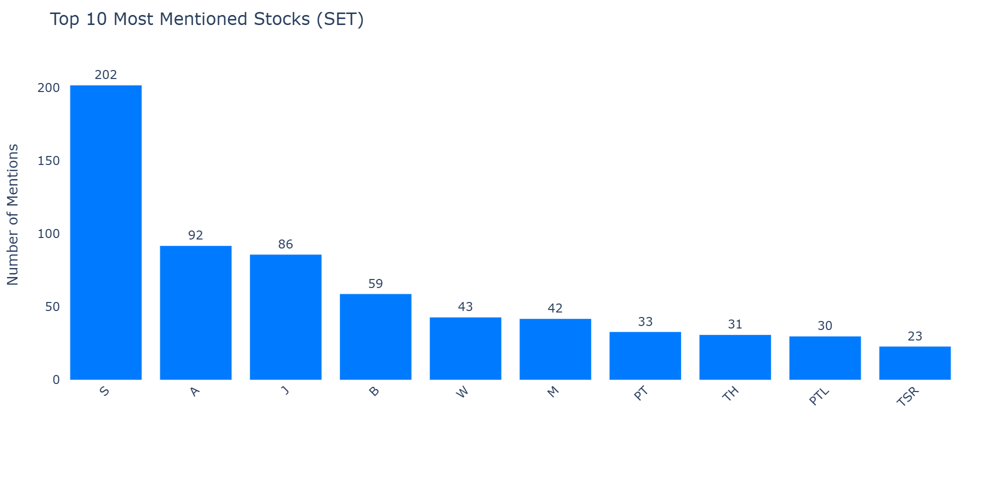
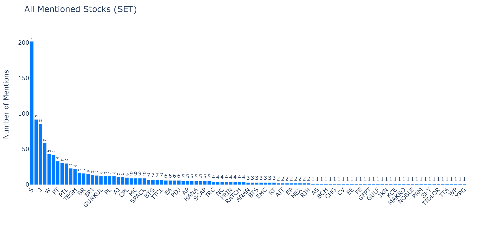
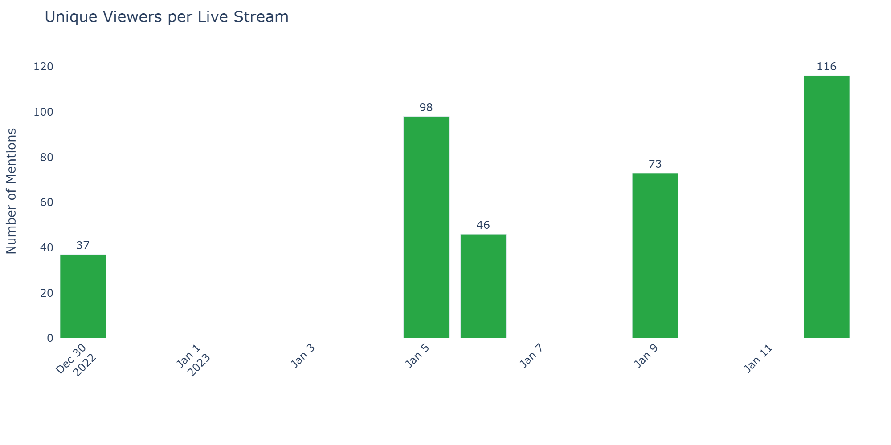
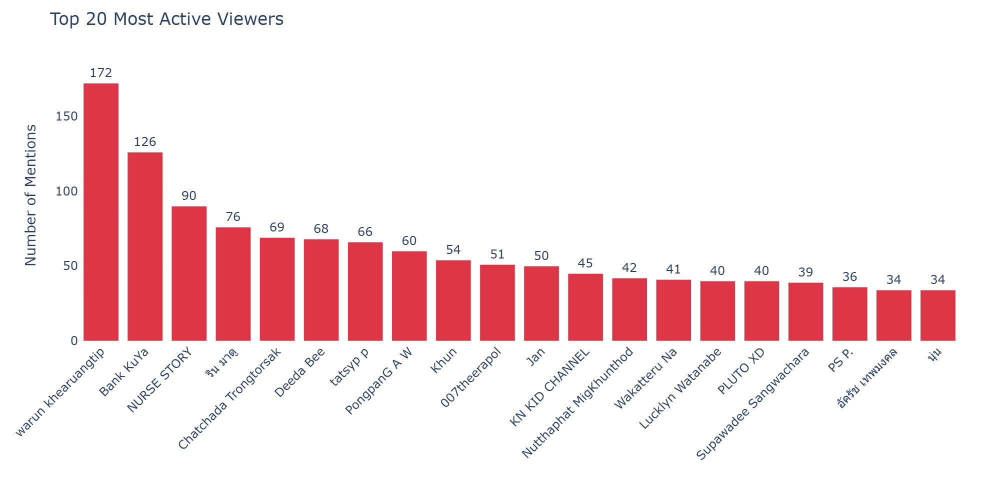
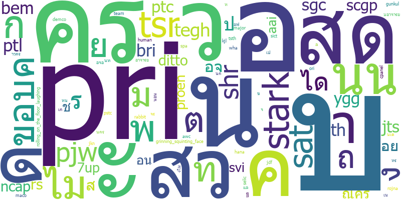
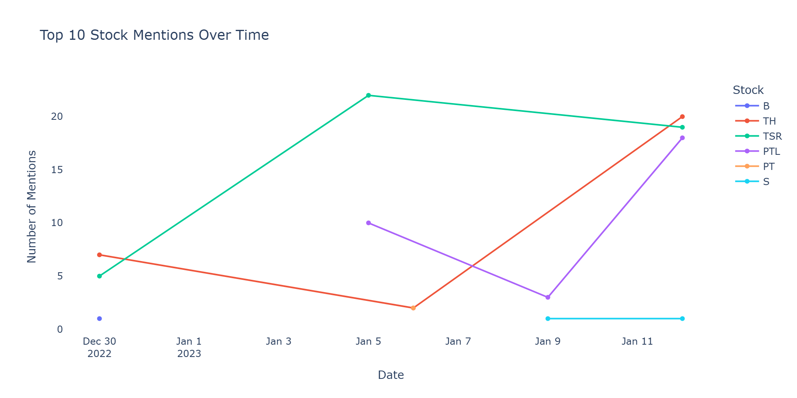

# Live Chat Analytics / วิเคราะห์ Live Chat

[](https://github.com/puwadonsri/DADS5001-Final-Project)
[](https://python.org)
[](https://dash.plotly.com)

> **Analyze Thai stock ticker mentions from YouTube Live Chat in real-time**  
> **วิเคราะห์กระแสหุ้นไทยจาก Live Chat บน YouTube แบบ Real-time**

---

## Overview / ภาพรวม

This project mines YouTube Live Chat messages from **MONEY HERO** (@moneyheroschool) — a Thai financial education channel — to identify which **SET (Stock Exchange of Thailand)** stocks are being discussed the most during live streams.

โปรเจกต์นี้ดึงข้อมูล Live Chat จากช่อง **MONEY HERO** เพื่อวิเคราะห์ว่าหุ้นไทยตัวไหนถูกพูดถึงมากที่สุดในระหว่างการถ่ายทอดสด

### Data Flow / ขั้นตอนการทำงาน

```
YouTube Live Stream
       │
       ▼
┌──────────────────┐
│  YoutubeLive.py   │  ← Scrapes live chat using pytchat
│  (Scraper)        │  → MongoDB collection: chat_log
└──────────────────┘
       │
       ▼
┌─────────────────────┐
│ YoutubeAnalytics.py │  ← Matches messages against SET stock codes
│ (Analytics Engine)  │  → MongoDB collection: chat_analytics
└─────────────────────┘
       │
       ▼
┌──────────────────┐
│    main.py        │  ← Dash web dashboard (port 1111)
│ (Dashboard)      │  → 6 interactive pages
└──────────────────┘
```

---

## Features / คุณสมบัติ

| # | Page / หน้า | Description / คำอธิบาย |
|---|-------------|----------------------|
| 1 | **Top 10 Stocks** | Most mentioned stocks (bar chart + table) / หุ้นที่ถูกพูดถึงมากที่สุด 10 อันดับ |
| 2 | **All Stocks** | Complete list of mentioned stocks / หุ้นทั้งหมดที่ถูกพูดถึง |
| 3 | **Viewers by Date** | Unique viewers per live stream day / จำนวนผู้ชมในแต่ละวัน |
| 4 | **Top Viewers** | Most active chatters / ผู้ชมที่ส่งข้อความมากที่สุด |
| 5 | **Word Cloud** | Visual word frequency from chat messages / คำที่พบบ่อยใน Chat |
| 6 | **Mentions Over Time** | Trend of top stock mentions across dates / แนวโน้มการพูดถึงหุ้นตามวัน |

### Tech Stack

| Component | Technology |
|-----------|-----------|
| Language | Python 3 |
| Web Framework | Dash (Plotly) + Bootstrap |
| Visualization | Plotly Express, Matplotlib, WordCloud |
| Database | MongoDB (with JSON fallback) |
| YouTube API | pytchat |

---

## Dashboard Preview / ตัวอย่างกราฟ

> Charts generated from actual chat data (Jan 9–13, 2023) — 5 live streams, ~9,400 messages.

### 1. Top 10 Stocks / หุ้น 10 อันดับแรก



Bar chart showing the 10 most frequently mentioned SET stocks across all live streams.  
กราฟแท่งแสดงหุ้น SET 10 อันดับที่ถูกพูดถึงมากที่สุดใน Live Chat

---

### 2. All Stocks / หุ้นทั้งหมด



Complete ranked list of every SET stock mentioned during the live streams.  
อันดับหุ้น SET ทั้งหมดที่ถูกพูดถึงใน Live Chat เรียงตามจำนวนครั้ง

---

### 3. Viewers by Date / ผู้ชมตามวัน



Number of unique viewers per live stream day.  
จำนวนผู้ชมที่ไม่ซ้ำกันในแต่ละวันที่มี Live

---

### 4. Top Viewers / ผู้ชมที่แอคทีฟที่สุด



Top 20 most active users ranked by total chat messages sent.  
ผู้ชม 20 อันดับที่ส่งข้อความใน Live Chat มากที่สุด

---

### 5. Word Cloud / คำที่พบบ่อย



Visual representation of the most frequent words appearing in chat messages.  
ภาพแสดงคำที่ถูกพูดถึงบ่อยที่สุดใน Live Chat (Word Cloud)

---

### 6. Mentions Over Time / แนวโน้มการพูดถึง



Multi-series line chart tracking how often each of the top 10 stocks was mentioned per date.  
กราฟเส้นแสดงแนวโน้มการพูดถึงหุ้น Top 10 ในแต่ละวัน

---

## Installation / การติดตั้ง

```bash
# Clone the repo
git clone https://github.com/puwadonsri/DADS5001-Final-Project.git
cd DADS5001-Final-Project

# Install dependencies
pip install -r requirements.txt

# (Optional) Start MongoDB
# docker run -d -p 27017:27017 mongo
```

---

## Usage / วิธีใช้งาน

### 1. Scrape YouTube Live Chat

```bash
python YoutubeLive.py
```

> **Note:** This requires an active YouTube Live stream. The video ID is hardcoded — edit `YoutubeLive.py` to change it.  
> **หมายเหตุ:** ต้องมี Live Stream ที่กำลังออกอากาศอยู่ สามารถเปลี่ยน Video ID ในไฟล์ `YoutubeLive.py`

### 2. Analyze Stock Mentions

```bash
python YoutubeAnalytics.py
```

Counts how many times each SET stock ticker appears in chat messages using **word-boundary regex matching** for accuracy.

นับจำนวนครั้งที่หุ้นแต่ละตัวถูกพูดถึงในข้อความ โดยใช้ **Word-Boundary Regex** เพื่อความแม่นยำ

### 3. Launch Dashboard

```bash
python main.py
```

Open http://localhost:1111 in your browser.

> **No MongoDB? No problem.** The dashboard automatically falls back to JSON files (`json_dataset/chat_log.json`, `json_dataset/chat_analytics.json`) if MongoDB is unavailable.  
> **ไม่มี MongoDB? ไม่ต้องห่วง** Dashboard จะโหลดข้อมูลจาก JSON files โดยอัตโนมัติ

---

## Dataset / ข้อมูล

- **Source:** YouTube channel [MONEY HERO](https://www.youtube.com/@moneyheroschool)
- **Period:** January 9–13, 2023 (5 live streams)
- **Chat messages:** ~9,400 messages
- **Stock codes:** 682 SET-listed companies from `json_dataset/company.csv`
- **Pre-computed analytics:** Included in `json_dataset/` for immediate use

---

## Live Streams / ลิงก์ถ่ายทอดสด

| Date | Title | Link |
|------|-------|------|
| 09 Jan 2023 | หุ้นเด่นรอบวัน | [Watch](https://www.youtube.com/watch?v=T54j0ujWN9o&t=341s) |
| 10 Jan 2023 | หุ้นเด่นรอบวัน | [Watch](https://www.youtube.com/watch?v=brE8_gE014w&t=11s) |
| 11 Jan 2023 | หุ้นเด่นรอบวัน | [Watch](https://www.youtube.com/watch?v=BiFSgJThu_c&t=96s) |
| 12 Jan 2023 | หุ้นเด่นรอบวัน | [Watch](https://www.youtube.com/watch?v=RWKLlk9g3ss&t=16s) |
| 13 Jan 2023 | หุ้นเด่นรอบวัน | [Watch](https://www.youtube.com/watch?v=cAqJiaSUw2Y&t=125s) |

---

## Project Structure / โครงสร้างโปรเจกต์

```
├── main.py                    # Dash web dashboard (6 pages)
├── YoutubeLive.py             # YouTube live chat scraper
├── YoutubeAnalytics.py        # Stock mention analyzer
├── generate_charts.py         # Script to generate dashboard preview images
├── requirements.txt           # Python dependencies
├── .gitignore
├── README.md
├── PresentBY.txt
├── images/                    # Dashboard preview images
│   ├── top10_stocks.png
│   ├── all_stocks.png
│   ├── viewers_by_date.png
│   ├── top_viewers.png
│   ├── wordcloud.png
│   └── mentions_over_time.png
├── json_dataset/
│   ├── chat_log.json          # Raw chat messages (JSON fallback)
│   ├── chat_analytics.json    # Pre-computed stock mentions (JSON fallback)
│   └── company.csv            # 682 SET stock codes
```

---

## Improvements in This Version / การปรับปรุงในเวอร์ชันนี้

- **✅ Accurate stock matching** — Uses regex word boundaries (`\b`) instead of naive `str.contains()` to avoid false positives
- **✅ 6 dashboard pages** — Added Word Cloud and Mentors Over Time pages
- **✅ JSON fallback** — Dashboard works without MongoDB
- **✅ Refactored code** — DRY principles, callback-based data loading
- **✅ Error handling** — Graceful failures throughout
- **✅ Bilingual documentation** — Thai + English


---

## Video Overview / วิดีโออธิบาย

[](https://youtu.be/OBHS47BvNMQ)

---

## License

MIT
