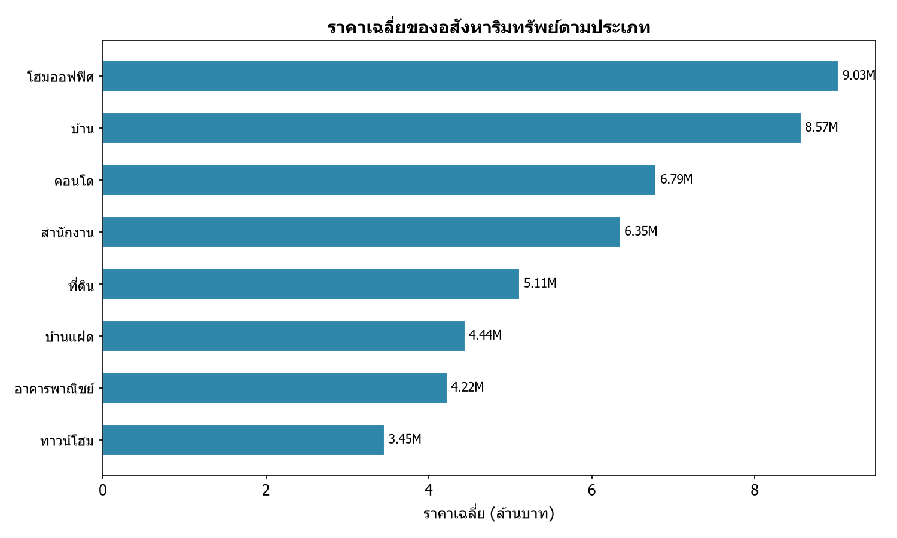
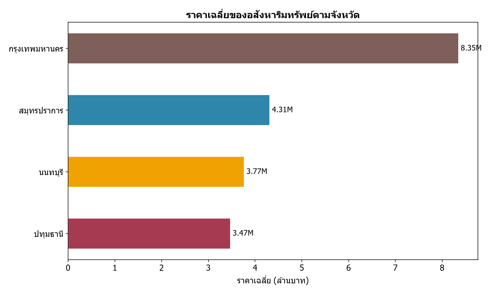
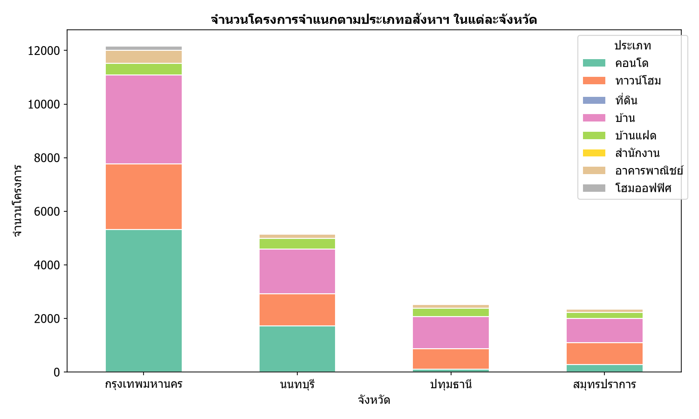
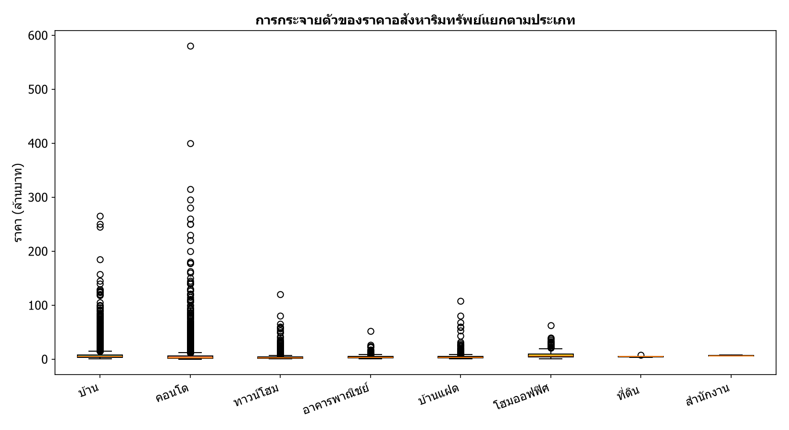
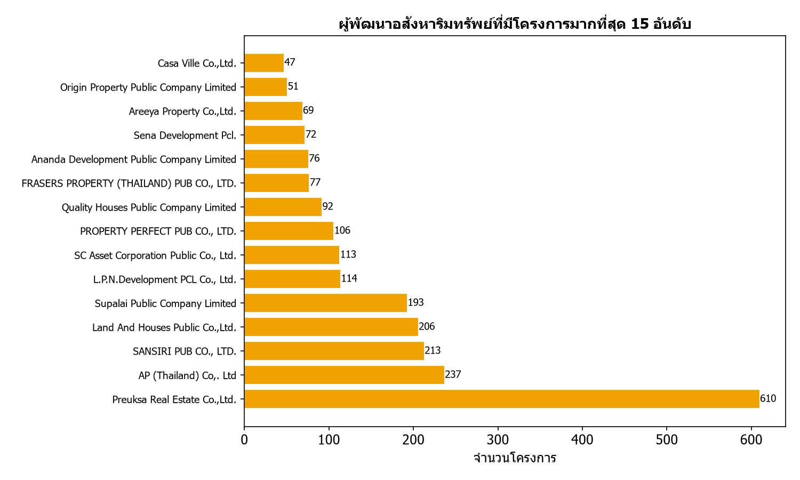
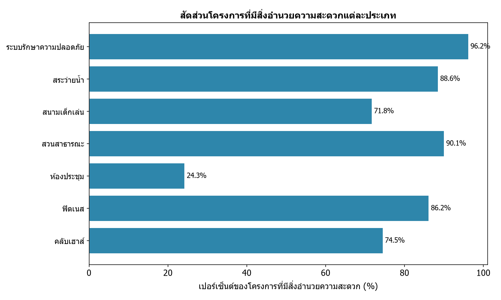
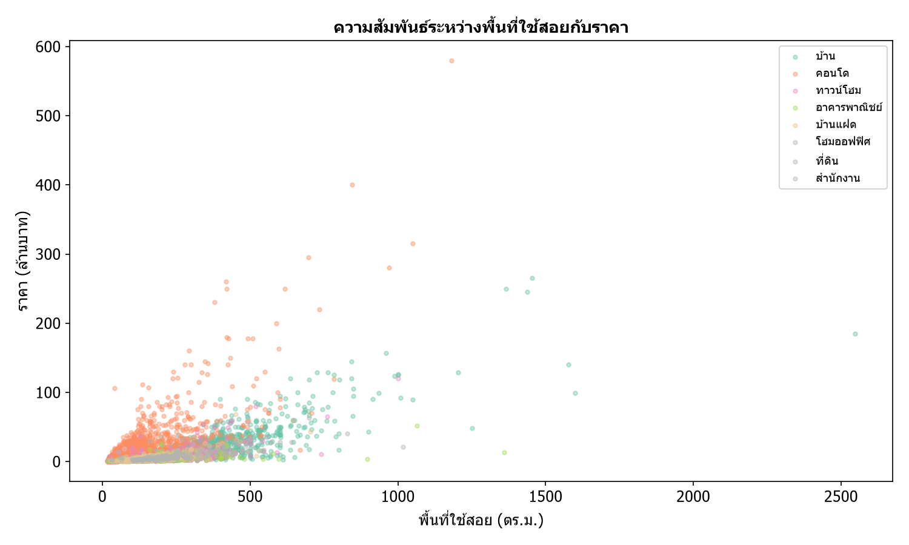
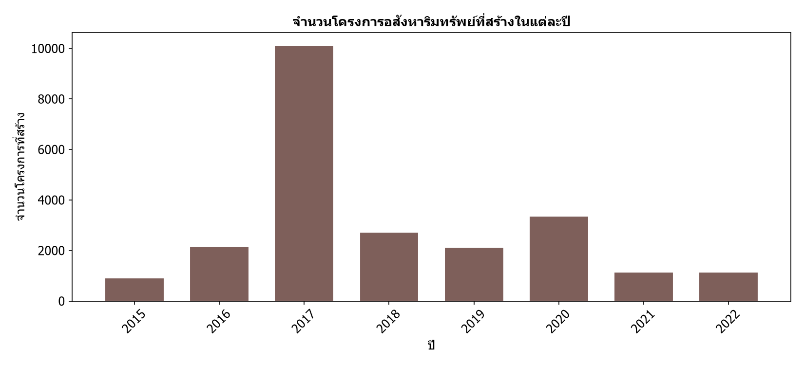
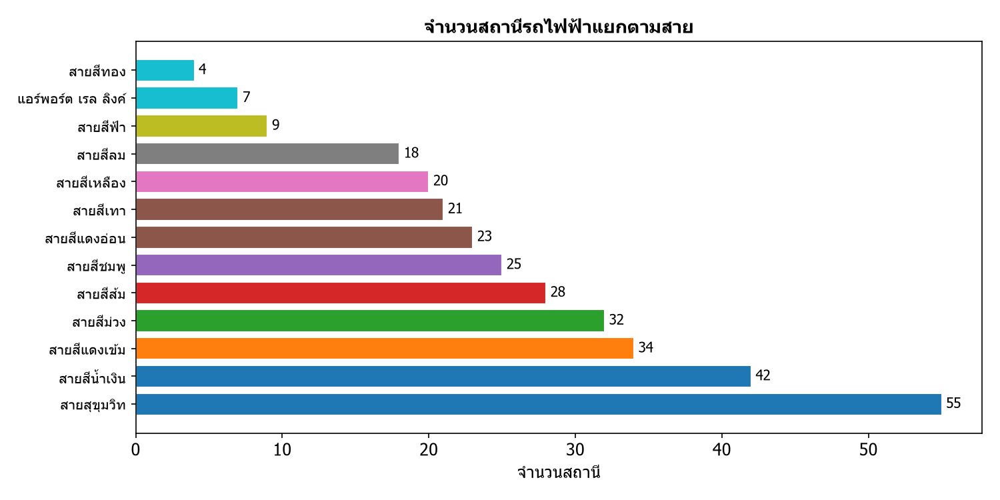

# 🏠 การพัฒนาอสังหาริมทรัพย์กระจุกตัวอยู่ตามแนวรถไฟฟ้า?

[](https://github.com/puwadonsri/Project_DADS5001)
[](https://python.org)
[](https://pandas.pydata.org)
[](https://plotly.com)
[](https://matplotlib.org)
[](https://colab.research.google.com)

> **วิเคราะห์ความสัมพันธ์ระหว่างการพัฒนาอสังหาริมทรัพย์กับแนวรถไฟฟ้าในเขตกรุงเทพฯ และปริมณฑล**  
> ใช้ข้อมูลโครงการที่อยู่อาศัยกว่า 23,000 โครงการ และข้อมูลสถานีรถไฟฟ้ากว่า 300 สถานี

---

## 📋 สารบัญ

- [ที่มาและความสำคัญ](#-ที่มาและความสำคัญ)
- [ชุดข้อมูลที่ใช้](#-ชุดข้อมูลที่ใช้)
- [คำถามที่ต้องการหาคำตอบ](#-คำถามที่ต้องการหาคำตอบ)
- [การวิเคราะห์หลัก](#-การวิเคราะห์หลัก)
  - [1. การกระจายตัวตามแนวรถไฟฟ้า](#1-การกระจายตัวตามแนวรถไฟฟ้า)
  - [2.1 ราคาเฉลี่ยตามประเภทอสังหาฯ](#21-ราคาเฉลี่ยตามประเภทอสังหาฯ)
  - [2.2 ราคาเฉลี่ยตามจังหวัด](#22-ราคาเฉลี่ยตามจังหวัด)
- [การวิเคราะห์เพิ่มเติม](#-การวิเคราะห์เพิ่มเติม)
  - [3. จำนวนโครงการแยกตามประเภทในแต่ละจังหวัด](#3-จำนวนโครงการแยกตามประเภทในแต่ละจังหวัด)
  - [4. การกระจายตัวของราคา (Box Plot)](#4-การกระจายตัวของราคา-box-plot)
  - [5. ผู้พัฒนาโครงการมากที่สุด 15 อันดับ](#5-ผู้พัฒนาโครงการมากที่สุด-15-อันดับ)
  - [6. สัดส่วนสิ่งอำนวยความสะดวกในโครงการ](#6-สัดส่วนสิ่งอำนวยความสะดวกในโครงการ)
  - [7. ความสัมพันธ์ระหว่างพื้นที่ใช้สอยกับราคา](#7-ความสัมพันธ์ระหว่างพื้นที่ใช้สอยกับราคา)
  - [8. แนวโน้มการพัฒนาโครงการในแต่ละปี](#8-แนวโน้มการพัฒนาโครงการในแต่ละปี)
  - [9. จำนวนสถานีรถไฟฟ้าแยกตามสาย](#9-จำนวนสถานีรถไฟฟ้าแยกตามสาย)
- [บทสรุปและข้อจำกัด](#-บทสรุปและข้อจำกัด)
- [แนวทางการวิเคราะห์เพิ่มเติม](#-แนวทางการวิเคราะห์เพิ่มเติม)
- [References](#-references)

---

## 📌 ที่มาและความสำคัญ

ในยุคที่รถไฟฟ้ากลายเป็นปัจจัยสำคัญในการเลือกที่อยู่อาศัยของคนเมือง นักพัฒนาอสังหาฯ ต่างแข่งขันกันพัฒนาโครงการตามแนวรถไฟฟ้า โปรเจกต์นี้เกิดขึ้นเพื่อ **พิสูจน์สมมติฐาน** ว่าการพัฒนาอสังหาริมทรัพย์กระจุกตัวตามแนวรถไฟฟ้าจริงหรือไม่ และราคามีความสัมพันธ์กับระยะทางจากรถไฟฟ้าอย่างไร

---

## 📊 ชุดข้อมูลที่ใช้

| Dataset | รายละเอียด | จำนวน |
|---------|-----------|-------|
| **Residential Project Data** | ข้อมูลโครงการที่อยู่อาศัยประเภทจัดสรร — ที่ตั้ง ผู้พัฒนา สิ่งอำนวยความสะดวก | 23,744 rows × 46 cols |
| **Unit Type Data** | ข้อมูลแบบบ้านในแต่ละโครงการ — ราคา พื้นที่ จำนวนห้อง | 43,133 rows × 28 cols |
| **City Train Station** | ข้อมูลสถานีรถไฟฟ้าทั้งที่เปิดแล้วและอยู่ในแผนพัฒนา | 318 rows × 20 cols |

> **แหล่งที่มา:** [Bestimate By Baania](https://gobestimate.com/data)

---

## ❓ คำถามที่ต้องการหาคำตอบ

| # | คำถาม | สมมติฐาน |
|---|-------|---------|
| 1 | อสังหาฯ กระจุกตัวตามแนวรถไฟฟ้าหรือไม่? | ขึ้นอยู่กับประเภทของอสังหาฯ — คอนโดน่าจะกระจุกตัวมากกว่าบ้านเดี่ยว |
| 2 | ราคาแพงขึ้นตามระยะทางที่ใกล้รถไฟฟ้าหรือไม่? | พื้นที่ที่มีรถไฟฟ้าหนาแน่น (กรุงเทพฯ) น่าจะมีราคาสูงที่สุด |

---

## 🔍 การวิเคราะห์หลัก

### 1. การกระจายตัวตามแนวรถไฟฟ้า

> **หมายเหตุ:** กราฟนี้สร้างจาก Plotly Mapbox ใน Notebook (ต้องรันด้วย Jupyter/Colab เพื่อดู interactive map)

แผนที่แสดงตำแหน่งโครงการที่อยู่อาศัย (สีม่วง) เทียบกับสถานีรถไฟฟ้า (สีฟ้า) ในพื้นที่กรุงเทพฯ และปริมณฑล

**สิ่งที่ค้นพบ:**
- โครงการบ้านเดี่ยวและทาวน์โฮมกระจายตัวในวงกว้าง ไม่ได้กระจุกตามแนวรถไฟฟ้า
- คอนโดมิเนียมมีแนวโน้มกระจุกตัวตามแนวรถไฟฟ้ามากกว่า
- พื้นที่ชานเมืองมีโครงการบ้านจัดสรรจำนวนมากที่ห่างจากรถไฟฟ้า

---

### 2.1 ราคาเฉลี่ยตามประเภทอสังหาฯ



**คำอธิบาย:** กราฟแท่งแนวนอนแสดงราคาเฉลี่ยของอสังหาฯ แต่ละประเภท (หน่วย: ล้านบาท) เฉพาะในเขตกรุงเทพฯ และปริมณฑล

**สิ่งที่ค้นพบ:**
- **บ้านเดี่ยว** ราคาเฉลี่ยสูงที่สุด (~5.4 ล้านบาท) เนื่องจากมีพื้นที่ขนาดใหญ่และเป็นที่ต้องการของครอบครัว
- **ทาวน์โฮม** และ **คอนโด** ราคาใกล้เคียงกัน (~3-3.5 ล้านบาท)
- **อาคารพาณิชย์** มีราคาเฉลี่ยสูง (~4.8 ล้านบาท) แต่มีจำนวนน้อย

**วิเคราะห์เพิ่มเติม:**
- ทำไมบ้านเดี่ยวถึงมีราคาสูงกว่าคอนโดเกือบเท่าตัว? → เพราะรวมค่าที่ดินซึ่งมีขนาดใหญ่กว่ามาก
- เปรียบเทียบราคาต่อตารางเมตรของแต่ละประเภทเพื่อวัดความคุ้มค่า

---

### 2.2 ราคาเฉลี่ยตามจังหวัด



**คำอธิบาย:** กราฟแท่งแนวนอนเปรียบเทียบราคาเฉลี่ยของอสังหาฯ ในแต่ละจังหวัดในเขตกรุงเทพฯ และปริมณฑล

**สิ่งที่ค้นพบ:**
- **กรุงเทพฯ** ราคาเฉลี่ยสูงสุด (~4.6 ล้าน) — ศูนย์กลางเศรษฐกิจ มีรถไฟฟ้าหนาแน่น
- **นนทบุรี** (~4 ล้าน) — มี BTS สายสีม่วงและสีเขียวผ่าน
- **สมุทรปราการ** (~3.5 ล้าน) — มี BTS สายสีเขียวขยายไปถึง
- **ปทุมธานี** (~3.3 ล้าน) — ต่ำที่สุด แม้มีรถไฟฟ้าสายสีแดงผ่าน แต่พื้นที่ส่วนใหญ่ยังเป็นชนบท

**วิเคราะห์เพิ่มเติม:**
- คำนวณ correlation ระหว่างจำนวนสถานีรถไฟฟ้าในจังหวัดกับราคาเฉลี่ย
- เปรียบเทียบราคาโครงการที่อยู่ห่างจากสถานี < 500m, < 1km, < 3km

---

## 📈 การวิเคราะห์เพิ่มเติม

### 3. จำนวนโครงการแยกตามประเภทในแต่ละจังหวัด



**คำอธิบาย:** กราฟแท่ง stacked แสดงจำนวนโครงการในแต่ละจังหวัด แยกตามประเภทของอสังหาฯ

**สิ่งที่ค้นพบ:**
- **กรุงเทพฯ** มีจำนวนโครงการมากที่สุด โดยเฉพาะคอนโดและบ้านเดี่ยว
- **นนทบุรี** มีสัดส่วนบ้านเดี่ยวสูง — เหมาะสำหรับครอบครัวที่ต้องการบ้านราคาไม่สูงมาก
- **สมุทรปราการ** และ **ปทุมธานี** มีโครงการน้อยกว่า สะท้อนว่าการพัฒนายังไม่หนาแน่นเท่า

**วิเคราะห์เพิ่มเติม:**
- เปรียบเทียบสัดส่วนของโครงการแต่ละประเภทในแต่ละจังหวัด → จังหวัดไหนเน้นคอนโด vs บ้านเดี่ยว?
- วิเคราะห์แนวโน้มการพัฒนาในอนาคต: จังหวัดใดมีศักยภาพในการเติบโต?

---

### 4. การกระจายตัวของราคา (Box Plot)



**คำอธิบาย:** Box Plot แสดงการกระจายตัวของราคาอสังหาฯ แต่ละประเภท โดยแสดงค่าต่ำสุด Q1, median, Q3, และค่าสูงสุด (ไม่รวม outlier)

**สิ่งที่ค้นพบ:**
- **บ้านเดี่ยว** มีช่วงราคากว้างที่สุด — ตั้งแต่หลักแสนจนถึงหลายสิบล้าน
- **คอนโด** มี median ต่ำกว่าบ้านเดี่ยว แต่มี outlier ที่ราคาสูงมาก (penthouse, luxury condo)
- **ทาวน์โฮม** มีช่วงราคาแคบที่สุด — ราคาค่อนข้างคงที่
- **อาคารพาณิชย์** มี median สูงแต่จำนวนน้อย

**วิเคราะห์เพิ่มเติม:**
- ใช้ IQR เพื่อหากลุ่มราคาที่เหมาะสมสำหรับผู้ซื้อแต่ละประเภท
- วิเคราะห์ outlier: โครงการอะไรที่ราคาสูงผิดปกติ? อยู่ที่ไหน? ของ developer ไหน?

---

### 5. ผู้พัฒนาโครงการมากที่สุด 15 อันดับ



**คำอธิบาย:** กราฟแท่งแสดงผู้พัฒนาอสังหาฯ ที่มีจำนวนโครงการมากที่สุด 15 อันดับแรกในเขตกรุงเทพฯ และปริมณฑล

**สิ่งที่ค้นพบ:**
- บริษัทพัฒนารายใหญ่มีโครงการนับร้อยโครงการ ครอบคลุมหลายทำเล
- ผู้พัฒนากลุ่ม TOP มีการกระจายตัวของโครงการทั้งในกรุงเทพฯ และปริมณฑล

**วิเคราะห์เพิ่มเติม:**
- วิเคราะห์ส่วนแบ่งตลาด (market share) ของผู้พัฒนาแต่ละราย
- เปรียบเทียบราคาเฉลี่ยของโครงการของแต่ละ developer — ใครเน้นตลาดบน ใครเน้นตลาดล่าง?
- วิเคราะห์ว่า developer รายใหญ่มีแนวโน้มพัฒนาโครงการตามแนวรถไฟฟ้ามากกว่าหรือไม่

---

### 6. สัดส่วนสิ่งอำนวยความสะดวกในโครงการ



**คำอธิบาย:** กราฟแท่งแสดงเปอร์เซ็นต์ของโครงการที่มีสิ่งอำนวยความสะดวกแต่ละประเภท

**สิ่งที่ค้นพบ:**
- **ระบบรักษาความปลอดภัย** มีมากที่สุด (~70%) — เป็นปัจจัยพื้นฐานที่โครงการส่วนใหญ่มี
- **สวนสาธารณะ** (~50%) และ **สระว่ายน้ำ** (~40%) เป็นสิ่งอำนวยความสะดวกที่พบบ่อยรองลงมา
- **คลับเฮาส์** (~30%) และ **ฟิตเนส** (~35%) พบในโครงการระดับกลางขึ้นไป
- **ห้องประชุม** และ **สนามเด็กเล่น** พบน้อยที่สุด (~10-25%) — เป็นสิ่งอำนวยความสะดวกเฉพาะกลุ่ม

**วิเคราะห์เพิ่มเติม:**
- โครงการที่มีสิ่งอำนวยความสะดวกครบมีราคาสูงกว่าโครงการที่ไม่มีเท่าไร? (facility premium)
- สิ่งอำนวยความสะดวกประเภทไหนที่ส่งผลต่อราคามากที่สุด? (ใช้ regression)
- เปรียบเทียบสัดส่วนสิ่งอำนวยความสะดวกระหว่างคอนโด vs บ้านเดี่ยว

---

### 7. ความสัมพันธ์ระหว่างพื้นที่ใช้สอยกับราคา



**คำอธิบาย:** Scatter plot แสดงความสัมพันธ์ระหว่างพื้นที่ใช้สอย (ตร.ม.) กับราคา (ล้านบาท) แยกตามสีตามประเภทอสังหาฯ

**สิ่งที่ค้นพบ:**
- ความสัมพันธ์เป็น **เชิงบวก** — พื้นที่มากขึ้น ราคาสูงขึ้น (ตามที่คาด)
- **บ้านเดี่ยว** (สีส้ม) มีทั้งพื้นที่และราคากว้างที่สุด กระจายตัวมาก
- **คอนโด** (สีเขียว) มีพื้นที่แคบกว่า แต่ราคาต่อตารางเมตรสูงกว่า — สะท้อนทำเลที่ตั้งในเมือง
- **ทาวน์โฮม** (สีม่วง) มีพื้นที่และราคาค่อนข้างคงที่

**วิเคราะห์เพิ่มเติม:**
- คำนวณค่า **ราคาต่อตารางเมตร** ของแต่ละประเภท — อสังหาฯ ประเภทไหนคุ้มค่าที่สุด?
- สร้าง Linear Regression model: `price = β₀ + β₁ × area` แยกตามประเภท
- วิเคราะห์ residual: โครงการไหนที่ราคาสูง/ต่ำกว่าที่ควรจะเป็น?

---

### 8. แนวโน้มการพัฒนาโครงการในแต่ละปี



**คำอธิบาย:** กราฟแท่งแสดงจำนวนโครงการอสังหาฯ ที่ถูกสร้างในแต่ละปี ตั้งแต่ปี 2014-2022

**สิ่งที่ค้นพบ:**
- **ปี 2019** มีจำนวนโครงการมากที่สุด — สอดคล้องกับภาวะเศรษฐกิจก่อน COVID-19
- **ปี 2020-2021** จำนวนโครงการลดลง — ผลกระทบจาก COVID-19 ทำให้การพัฒนาใหม่ชะลอตัว
- **ปี 2022** เริ่มฟื้นตัว — สะท้อนการกลับมาของเศรษฐกิจ

**วิเคราะห์เพิ่มเติม:**
- เปรียบเทียบแนวโน้มการพัฒนากับการขยายเส้นทางรถไฟฟ้าในแต่ละปี
- วิเคราะห์ประเภทอสังหาฯ ที่ได้รับความนิยมในแต่ละช่วงเวลา
- พยากรณ์แนวโน้มในอนาคตด้วย Time Series (ARIMA, Prophet)

---

### 9. จำนวนสถานีรถไฟฟ้าแยกตามสาย



**คำอธิบาย:** กราฟแท่งแสดงจำนวนสถานีรถไฟฟ้าในแต่ละสายที่มีใน dataset

**สิ่งที่ค้นพบ:**
- **BTS สายสีเขียว** (สุขุมวิท+สีลม) มีจำนวนสถานีมากที่สุด — เป็นโครงข่ายหลักของกรุงเทพฯ
- **MRT สายสีน้ำเงิน** และ **สีม่วง** มีจำนวนรองลงมา
- **Airport Rail Link** (SRT สายสีแดงอ่อน) มีจำนวนสถานีน้อยที่สุด — แต่ครอบคลุมระยะทางไกล

**วิเคราะห์เพิ่มเติม:**
- จับคู่โครงการที่อยู่ใกล้สถานีแต่ละสาย เพื่อวิเคราะห์ว่าราคาเฉลี่ยของโครงการใกล้ BTS vs MRT ต่างกันอย่างไร
- วิเคราะห์ว่าราคาที่ดินตามแนวรถไฟฟ้าสายใหม่ (สีชมพู, สีเหลือง, สีส้ม) มีแนวโน้มเพิ่มขึ้นหรือไม่

---

## 💡 บทสรุปและข้อจำกัด

### บทสรุป
| คำถาม | คำตอบ |
|-------|-------|
| อสังหาฯ กระจุกตัวตามแนวรถไฟฟ้าหรือไม่? | **บางส่วน** — คอนโดกระจุกตัวตามแนวรถไฟฟ้า แต่บ้านเดี่ยวกระจายตัวในวงกว้าง |
| ราคาแพงขึ้นตามระยะทางใกล้รถไฟฟ้าหรือไม่? | **ใช่** — กรุงเทพฯ ซึ่งมีรถไฟฟ้าหนาแน่นมีราคาสูงที่สุดในปริมณฑล |

### ข้อจำกัด
1. การจับคู่โครงการกับสถานีรถไฟฟ้าต้องคำนวณระยะทางจากพิกัด (latitude/longitude) — dataset นี้ยังไม่มีระยะทางที่คำนวณไว้
2. การ plot ทุกโครงการบนแผนที่ทำให้ข้อมูลทับซ้อน — ควรใช้ Heatmap หรือ clustering
3. การวิเคราะห์เฉพาะ 4 จังหวัดอาจไม่ครอบคลุมภาพรวมทั้งประเทศ

---

## 🚀 แนวทางการวิเคราะห์เพิ่มเติม

### ด้านเทคนิค
| แนวทาง | รายละเอียด |
|--------|-----------|
| **Distance Calculation** | ใช้ Haversine formula คำนวณระยะทางจากแต่ละโครงการ → สถานีที่ใกล้ที่สุด |
| **Price Gradient** | เปรียบเทียบราคาที่ distance < 500m vs 500m-1km vs 1-3km vs > 3km |
| **Heatmap** | ใช้ Density Heatmap แสดง clustering แทน scatter plot |
| **Price per sqm** | วิเคราะห์ราคาต่อตารางเมตร — อสังหาฯ ประเภทไหนคุ้มค่าที่สุด |
| **ML Model** | สร้าง Linear Regression / Random Forest เพื่อทำนายราคา |
| **Time Series** | พยากรณ์แนวโน้มการพัฒนาโครงการด้วย ARIMA |

### ด้านธุรกิจ
| แนวทาง | รายละเอียด |
|--------|-----------|
| **ROI Analysis** | ลงทุนตามแนวรถไฟฟ้าหรือพื้นที่ชานเมืองให้ผลตอบแทนดีกว่ากัน? |
| **Facility Premium** | ราคาโครงการที่มีสระว่ายน้ำ ฟิตเนส รปภ. สูงกว่าเท่าไร? |
| **Developer Strategy** | วิเคราะห์กลยุทธ์ของ developer แต่ละราย — เน้นทำเลไหน ราคาเท่าไร |
| **Neighborhood Analysis** | ย่านไหนกำลังมา? วิเคราะห์จากจำนวนโครงการใหม่และราคาที่เพิ่มขึ้น |

---

## 📚 References

1. **Dataset:** Bestimate By Baania — [gobestimate.com/data](https://gobestimate.com/data)
2. **Map Visualization:** Plotly Mapbox Layers — [plotly.com/python/mapbox-layers](https://plotly.com/python/mapbox-layers/)
3. **Thai Font Support:** Google Colab Font Installation — [Colab Notebook](https://colab.research.google.com/drive/1sTdTZx_Cm51mc8OL_QHtehWyO4725sGl)

---

### 🛠 วิธีใช้งาน

รัน Jupyter Notebook:
```bash
pip install pandas numpy matplotlib plotly
jupyter notebook DADS5001_PMiniProject.ipynb
```

หรือสร้างกราฟทั้งหมดด้วยสคริปต์:
```bash
python generate_charts.py
# ภาพกราฟจะถูกบันทึกในโฟลเดอร์ charts/
```

---

*โปรเจกต์นี้เป็นส่วนหนึ่งของวิชา DADS5001 Data Analytics Tools | จัดทำโดย ภูวดล ศรีธรรม และ ขนิษฐา ปะอันทัง*
